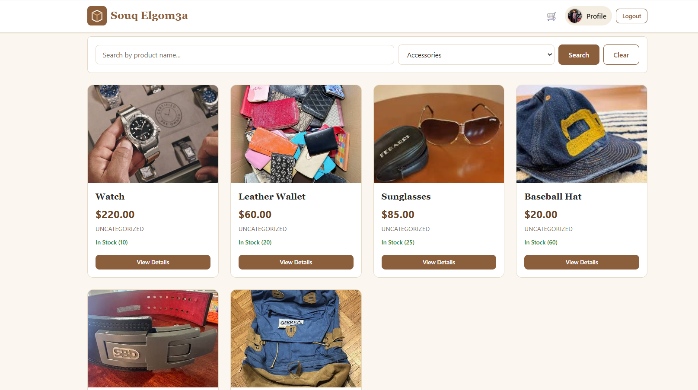
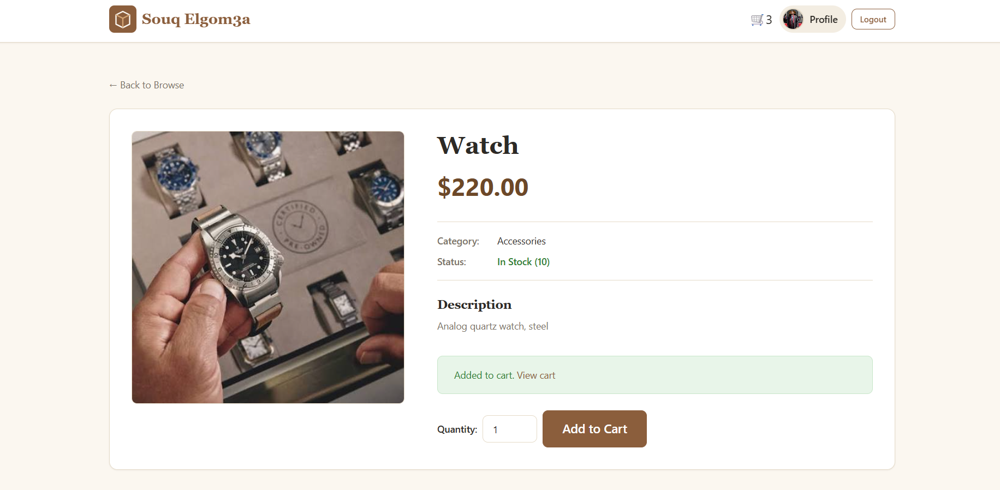
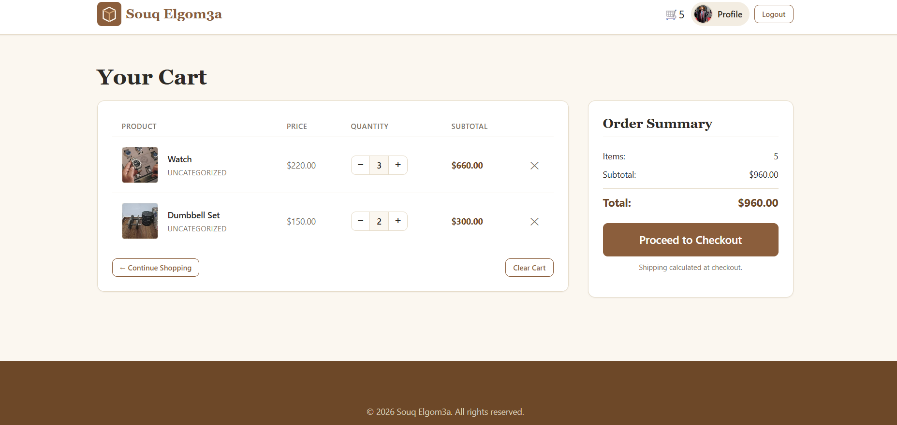
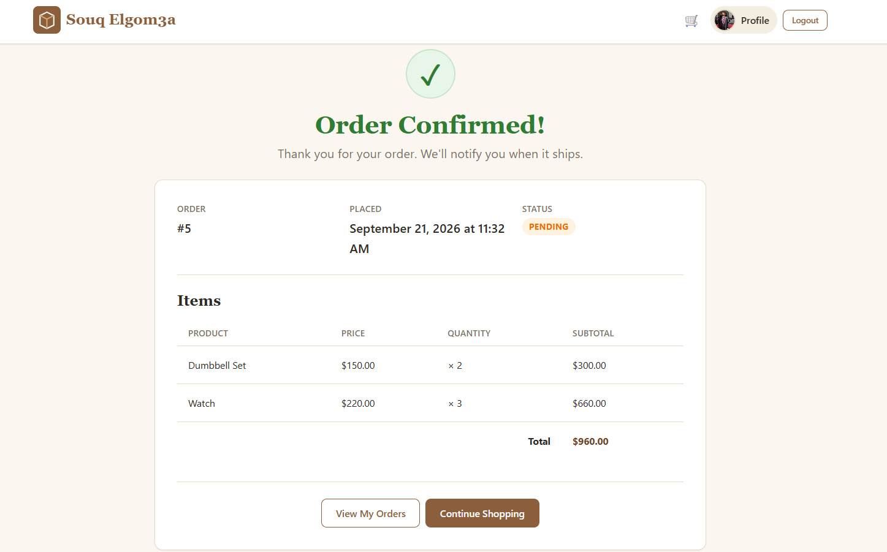
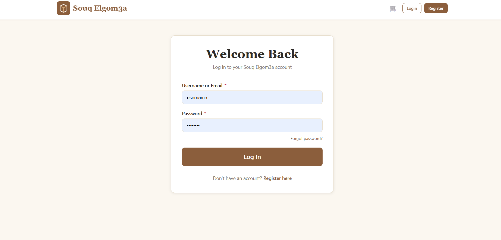
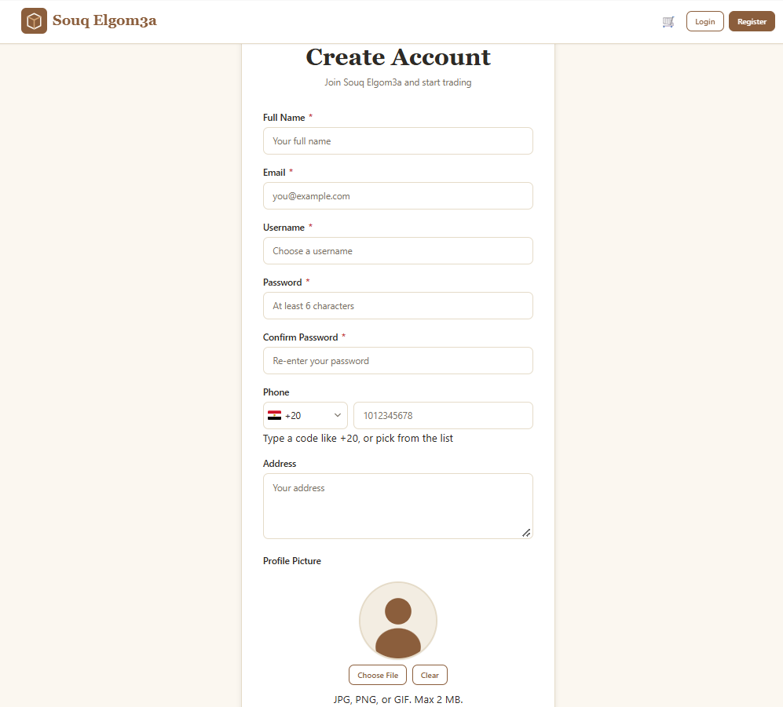
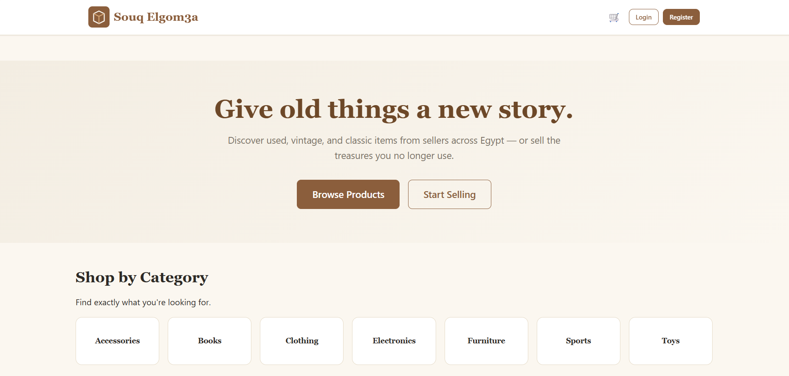

# 🛒 Souq Elgom3a

A full-featured online marketplace for used, vintage, and classic items —
built from scratch on **classic Java EE** (Servlets, JSP, JDBC, PostgreSQL),
without Spring, Hibernate, or any other high-level framework.

> **Why no framework?** The goal is to demonstrate the engineering concepts
> that frameworks usually abstract away: Servlet lifecycle, HTTP handling,
> session management, transactions, connection pooling, and concurrency safety.

---

## 📑 Table of Contents

- [Project Overview](#-project-overview)
- [Screenshots](#-screenshots)
- [Main Features](#-main-features)
- [Architecture](#%EF%B8%8F-architecture)
- [Technology Stack](#%EF%B8%8F-technology-stack)
- [Key Engineering Implementations](#-key-engineering-implementations)
- [Database Design](#%EF%B8%8F-database-design)
- [Project Structure](#-project-structure)
- [Security](#-security)
- [Getting Started](#-getting-started)
- [Testing](#-testing)

---

## 🎯 Project Overview

Souq Elgom3a is a marketplace where customers can:

- Browse products with search, category filter, and pagination
- Manage a shopping cart (guest or logged-in)
- Place orders
- View order history and manage their account

The application implements the full customer flow from registration to order
placement, with authentication, session management, transactional checkout,
and database-backed images.

---

## 📸 Screenshots

| Home |
|---|
|  |

| Product Details | Cart |
|---|---|
|  |  |

| Checkout & Order Confirmation |
|---|
|  |

| Login | Register |
|---|---|
|  |  |

| Customer Dashboard |
|---|
|  |

---

## ✨ Main Features

### Authentication & Account Management

- **Registration** — name, email, username, password, phone, address, profile
  picture; client + server validation; BCrypt hashing; transactional insert of
  user + customer rows; profile picture stored as `BYTEA`
- **Login** — accepts username or email; same error message for "not found"
  and "wrong password" (prevents enumeration); creates the `HttpSession` and
  merges the guest cart into the customer's DB cart
- **Logout** — invalidates the HTTP session
- **Forgot password** — cryptographically random 256-bit token (`SecureRandom`,
  URL-safe Base64), 1-hour expiry, emailed via Jakarta Mail; silent success for
  unknown emails
- **Reset password** — validates token existence + expiry; hashes the new
  password with BCrypt; **deletes the token** (single-use)

### Product Browsing

- Server-side **search** (`ILIKE`, case-insensitive)
- **Category filter**
- **Pagination** (12 products per page, "Page X of Y")
- Product detail page with image, price, category, description, stock status
- Out-of-stock indicator

### Shopping Cart

Two implementations, transparent to the caller:

| User | Storage |
|---|---|
| **Guest** | `HttpSession` — `Map<productId, quantity>` |
| **Logged-in customer** | PostgreSQL `cart_items` table |

**Merge on login:** guest cart is merged into the DB cart using PostgreSQL's
`ON CONFLICT ... DO UPDATE SET quantity = cart_items.quantity + EXCLUDED.quantity`.

Cart operations: add, increment, decrement, remove, clear. Stock is validated
on add.

### Checkout & Orders

The checkout is **fully transactional**:

1. Load and validate the cart
2. Sort items by product ID (deadlock prevention)
3. **Atomic stock decrement** per item — see [Concurrency-Safe Checkout](#-concurrency-safe-checkout)
4. Insert the `orders` row
5. Insert `order_items` with **frozen prices** (price at time of purchase)
6. Clear the customer's cart
7. Commit

Any failure → **ROLLBACK**. No partial orders.

Order history: list of past orders (newest first) + single-order view with
**ownership check** (customers can only see their own orders).

### Image Management

- Product and avatar images stored as `BYTEA` in PostgreSQL
- Served via a dedicated `ImageServlet`
- MIME detection via **magic bytes** (JPEG / PNG / GIF / WebP)
- HTTP caching (`Cache-Control: public, max-age=86400`)
- Streamed through `ServletOutputStream`
- JSP fallback: `onerror` swaps to an SVG placeholder

---

## 🏗️ Architecture

Custom MVC layering — no framework:

```
Browser
   ↓
JSP         (View — presentation only)
   ↓
Servlet     (Controller — HTTP handling)
   ↓
Service     (Business logic, validation, transactions)
   ↓
DAO         (SQL / JDBC only)
   ↓
HikariCP    (Connection pool)
   ↓
PostgreSQL
```

**Enforced boundaries:**

| From | To | Allowed? |
|---|---|---|
| Servlet | DAO | ❌ Never — always through Service |
| Service | HTTP (`HttpServletRequest`) | ❌ Never |
| DAO | Business logic | ❌ Never — SQL only |
| JSP | JDBC | ❌ Never — presentation only |

---

## 🔄 Request Flow

```
HTTP Request → Servlet → Service → DAO → PostgreSQL
                                            ↓
HTTP Response ← JSP ← Servlet ← Service ← DAO
```

**Example — placing an order:**

```
CheckoutServlet
   ↓
OrderService  (transaction)
   ├── CartService.loadItems()
   ├── ProductDAO.decrementStock()  ← atomic
   ├── OrderDAO.insert()
   ├── OrderItemDAO.insert()
   └── CartItemDAO.deleteByCustomer()
   ↓
PostgreSQL
```

---

## 🛠️ Technology Stack

| Technology | Usage |
|---|---|
| Java 21 | Core language |
| Jakarta Servlet 6.0 | HTTP request handling |
| JSP | Server-side rendering |
| JDBC | Database access |
| PostgreSQL 15+ | Relational database |
| HikariCP 5.1.0 | Connection pooling |
| Apache Tomcat 10.0.x | Application server |
| jBCrypt 0.4 | Password hashing |
| Jakarta Mail + Angus Mail | Password-reset emails |
| SLF4J | Logging (used by HikariCP) |
| HTML5 / CSS3 / Vanilla JS | Frontend |

**Deliberately avoided:** Spring, Spring Boot, Hibernate, JPA, Maven, Gradle.

---

## 💡 Key Engineering Implementations

### Layered MVC Architecture

Responsibilities are split manually — JSP (view), Servlet (controller),
Service (business logic), DAO (SQL) — following the same separation a
framework would enforce.

### Connection Pooling with HikariCP

Instead of opening a DB connection per request:

```
Application → HikariCP (pool of 10) → PostgreSQL
```

| Setting | Value |
|---|---|
| `maximumPoolSize` | 10 |
| `minimumIdle` | 2 |
| `connectionTimeout` | 30s |
| `idleTimeout` | 10 min |
| `maxLifetime` | 30 min |

Initialized once at startup by `AppContextListener`, closed at shutdown.

### Transaction Management

Operations that touch multiple tables run inside a single transaction with
explicit `commit()` / `rollback()`:

- **Registration** — insert `users` + `customers`
- **Checkout** — decrement stock, insert order + order_items, clear cart

Any failure → rollback → no partial state.

### Concurrency-Safe Checkout

**The problem:** two customers buy the last unit at the same time.

A naive read-check-write flow creates a **race condition** and can oversell.

**The solution — atomic conditional update:**

```sql
UPDATE products
SET stock = stock - ?
WHERE id = ? AND stock >= ?
```

The application checks the number of affected rows:

- **1 row** → stock reserved, proceed
- **0 rows** → insufficient stock → `BusinessException` → rollback

PostgreSQL's **row-level locking** ensures the second transaction waits, then
re-evaluates the `WHERE` clause against the latest committed value. No
application-level locking code is required.

**Deadlock prevention:** multi-item checkouts sort products by ID before
updating, establishing a deterministic lock order.

### Hybrid Shopping Cart

- **Guests** — cart in `HttpSession` (in-memory `Map`)
- **Customers** — cart in PostgreSQL

On login, the guest cart is merged into the DB cart with:

```sql
INSERT INTO cart_items (customer_id, product_id, quantity)
VALUES (?, ?, ?)
ON CONFLICT (customer_id, product_id)
DO UPDATE SET quantity = cart_items.quantity + EXCLUDED.quantity
```

Atomic. No race conditions.

### Authentication & Password Security

**Password storage:**

```
Plain password → BCrypt (work factor 10) → hash → DB
```

**Login verification:**

```
Entered password → BCrypt.checkpw() → stored hash → accept / reject
```

Plain-text passwords are **never** stored.

### Password Reset

Tokens are generated with `SecureRandom` (~256 bits of randomness), encoded
URL-safe (Base64), and:

- Stored in the DB with an expiry timestamp
- Valid for **1 hour**
- **Single-use** — deleted after successful reset

The response is identical whether the email exists or not — no enumeration.

### Database Image Storage

**Write:**

```
FileInputStream → PreparedStatement.setBinaryStream(...) → BYTEA
```

**Read:**

```
BYTEA → DAO (getBytes) → ImageServlet → ServletOutputStream → Browser
```

### Prepared Statements

All SQL uses `PreparedStatement` with `?` placeholders — never string
concatenation. This provides SQL-injection protection and clean parameter
handling.

### Post/Redirect/Get (PRG)

After every successful POST (register, login, add to cart, checkout), the
Servlet sends a **302 redirect**. The browser then issues a GET. Refreshing
the resulting page does not re-submit the form.

---

## 🗄️ Database Design

**8 tables:**

| Table | Purpose |
|---|---|
| `users` | Authentication — username, BCrypt hash, role |
| `customers` | Profile — name, email, phone, address, avatar (`BYTEA`) |
| `categories` | Product categories |
| `products` | Product catalog — name, price, stock, image (`BYTEA`) |
| `orders` | Order header — customer, date, total, status |
| `order_items` | Order lines — product, quantity, **frozen price** |
| `cart_items` | Logged-in customer carts — unique `(customer_id, product_id)` |
| `password_reset_tokens` | Single-use reset tokens with expiry |

**Relationships:**

```
users ──1:1── customers
                  │
                  ├──1:N── orders ──1:N── order_items ──N:1── products ──N:1── categories
                  │
                  └──1:N── cart_items ──N:1── products

users ──1:N── password_reset_tokens
```

**Key design decisions:**

- **Frozen order prices** — `order_items.price` copies the product price at
  purchase time, so historical orders keep their original price even if the
  product's price changes
- **Stock CHECK constraint** — `stock >= 0` enforced at DB level
- **Indexes** on high-frequency lookup columns: product name, category ID,
  customer orders, order status, and cart/reset-token lookups

---

## 📂 Project Structure

```
Souq-Elgom3a/
├── src/main/
│   ├── java/nti/
│   │   ├── dao/            # JDBC data access
│   │   ├── exceptions/     # BusinessException
│   │   ├── listeners/      # AppContextListener (HikariCP init)
│   │   ├── models/         # Plain data holders
│   │   ├── services/       # Business logic + transactions
│   │   ├── servlets/
│   │   │   ├── auth/       # Register, Login, Logout, Forgot/Reset
│   │   │   ├── common/     # Home, Image
│   │   │   └── customer/   # Browse, Cart, Checkout, Orders
│   │   └── utils/          # DBConnection, PasswordUtil, MailUtil, TokenUtil, ConfigUtil
│   │
│   ├── resources/
│   │   └── mail.properties.example
│   │
│   └── webapp/
│       ├── WEB-INF/
│       │   ├── lib/        # JARs
│       │   ├── partials/   # header.jsp, footer.jsp
│       │   └── web.xml
│       ├── css/
│       ├── js/
│       ├── images/
│       ├── customer/
│       └── *.jsp
│
├── database/
│   ├── 1-schema.sql
│   └── 2-seed-data.sql
│
├── screenshots/
│   ├── home.png
│   ├── browse.png
│   ├── product_detail.png
│   ├── cart.png
│   ├── place_order.png
│   ├── order_confirmation.png
│   ├── login.png
│   ├── Register.png
│   └── dashboard.png
│
└── README.md
```

---

## 🔐 Security

| Area | Mitigation |
|---|---|
| **Password storage** | BCrypt, work factor 10 |
| **SQL injection** | `PreparedStatement` everywhere |
| **Account enumeration (login)** | Same error for "not found" and "wrong password" |
| **Account enumeration (forgot password)** | Same success message regardless of email existence |
| **Password reset** | 256-bit random token, 1-hour expiry, single-use |
| **Order access** | Ownership verified before showing any order |
| **Session management** | `HttpSession`, 30-minute timeout; invalidated on logout |
| **Image serving** | MIME sniffed from magic bytes — never trusts file extension |
| **Secrets in Git** | `mail.properties` git-ignored; `.example` template committed |

---

## 🎨 Frontend

- **HTML5 / CSS3 / Vanilla JS** — no framework, no jQuery
- Custom responsive CSS with design tokens (colors, spacing, radius, shadows)
- Layout via Flexbox and CSS Grid
- Responsive breakpoints from 1024px down to 420px

**JavaScript features:**

- Password-strength indicator
- Password-match indicator
- Country-code picker (register)
- Profile-picture preview with 2 MB size guard
- Image `onerror` fallback to placeholder SVGs

---

## ⚙️ Configuration

Two places:

**`src/main/webapp/WEB-INF/web.xml`** — database credentials + HikariCP pool
settings (as `<context-param>` elements).

**`src/main/resources/mail.properties`** — SMTP configuration. **Git-ignored** —
the repo ships with `mail.properties.example` as a template.

In production, externalize both (env vars, secrets manager).

---

## 🚀 Getting Started

### Prerequisites

- JDK 21
- Apache Tomcat 10.0.x
- PostgreSQL 15+
- Eclipse (Enterprise Java) or any Dynamic Web Project capable IDE

### 1. Clone the repository

```bash
git clone <repository-url>
cd Souq-Elgom3a
```

### 2. Create the database

```sql
CREATE DATABASE "NTI_JavaEE_ECommerce";
```

Then run:

```bash
psql -U postgres -d NTI_JavaEE_ECommerce -f database/1-schema.sql
psql -U postgres -d NTI_JavaEE_ECommerce -f database/2-seed-data.sql
```

### 3. Configure database credentials

Edit `src/main/webapp/WEB-INF/web.xml` and set your PostgreSQL password in the
`db.password` context-param.

### 4. Configure email (only needed for password reset)

```bash
cp src/main/resources/mail.properties.example src/main/resources/mail.properties
```

Edit `mail.properties`:

- `mail.smtp.username` → your Gmail address
- `mail.smtp.password` → a Gmail **App Password** (requires 2FA)
- `mail.from` → your Gmail address

### 5. Deploy to Tomcat

- **Eclipse:** right-click project → Run As → Run on Server
- **Manual:** export as WAR → drop into `$CATALINA_HOME/webapps/`

### 6. Access the application

```
http://localhost:8080/NTI_JavaEE_ECommerce/
```

### Test accounts (from seed data)

All passwords: **`password123`**

| Username | Role |
|---|---|
| `admin` | ADMIN |
| `hesham` | CUSTOMER |
| `sara` | CUSTOMER |
| `ahmed` | CUSTOMER |

---

## 🧪 Testing

The application was tested manually across all main flows:

**Authentication**
- Registration (validation, uniqueness, hashing, transactional insert)
- Login (username/email, wrong credentials, session set)
- Logout (session invalidation)
- Forgot / reset password (token flow, expiry, single-use)

**Products**
- Browse, search, category filter, pagination
- Product details, image loading (real + fallback)

**Cart**
- Guest cart (session), customer cart (DB)
- Add / update / remove / clear
- Stock validation
- Guest → customer cart merge on login

**Checkout**
- Transactional order creation
- Stock decrement, order-item creation with frozen price
- Cart clearing
- Rollback on failure
- Concurrent stock protection (atomic update)

**Orders**
- Order confirmation (ownership check)
- Order history (newest first)

---

## 📝 License

Educational project — not licensed for commercial use.
